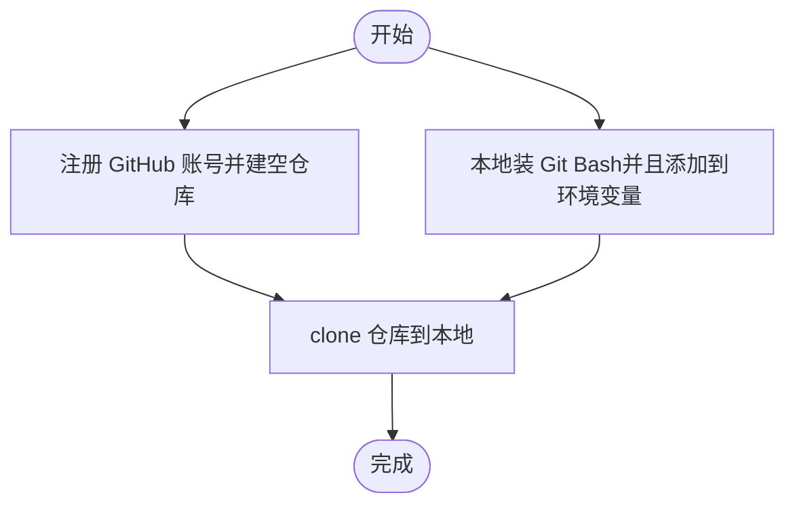

# SupremeK_server

## git使用

流程图

```mermaid
flowchart TD
    A([开始]) --> B[注册 GitHub 账号并建空仓库]
    A --> C[本地装 Git Bash并且添加到环境变量]
    B --> D[clone 仓库到本地]
    C --> D
    D --> E([完成])
```

1. 注册 GitHub 账号并建空仓库
   - 可以记一下地址啥的
2. 本地装 Git Bash并且添加到环境变量
   - 可以截图，把自己的截图记一下
3. clone 仓库到本地
   - 把命令步骤记一下
4. 完成

